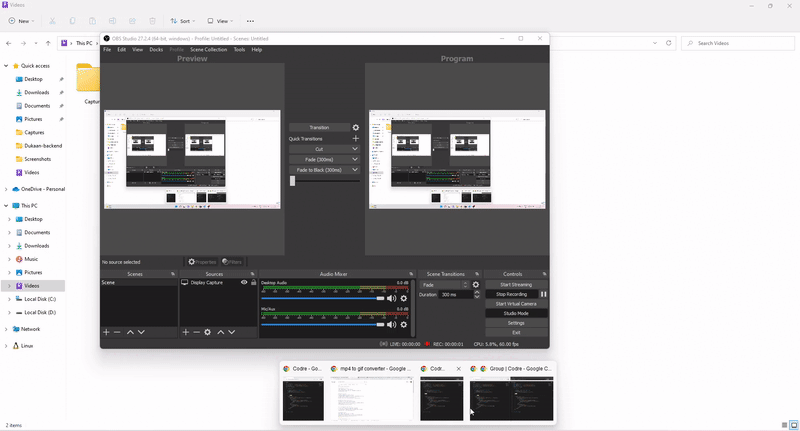
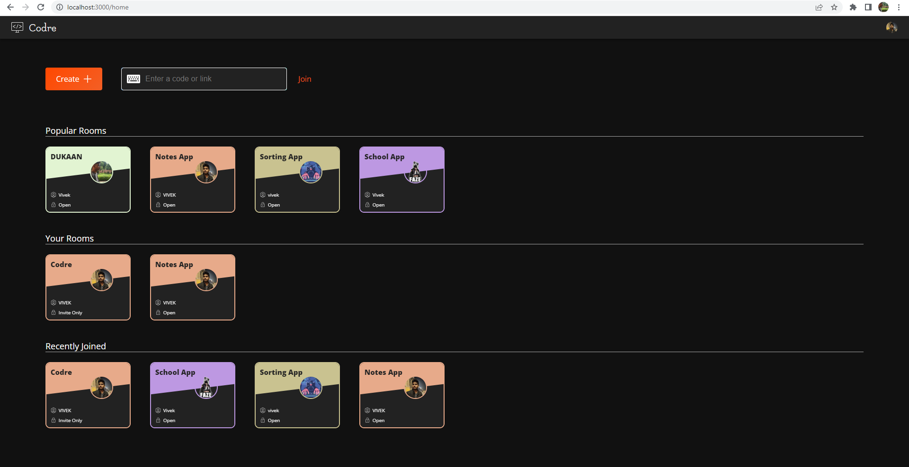

[Try It Here](https://www.codre.itsvivek.me/)

# Codre

**Codre** Collaborative coding is a tool where pairs or teams of
programmers work together on a project by coding each
other's ideas or editing each other's code.

---

# Screenshots

### Editor

### Home Page

